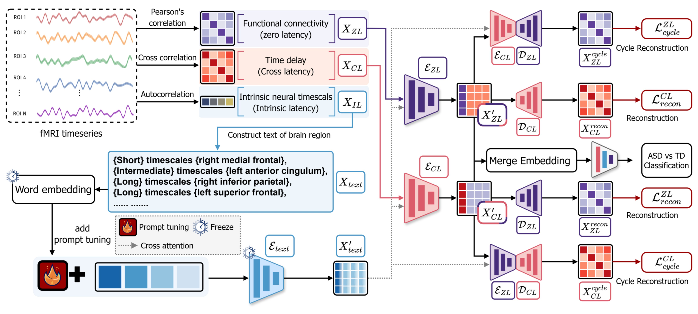

# PMIL: Prompt enhanced Multimodal Integrative analysis of fMRI combining functional connectivity and temporal Latency

Official page of "PMIL: Prompt enhanced Multimodal Integrative analysis of fMRI combining functional connectivity and temporal Latency" (MICCAI 2025)

[Paper](https://papers.miccai.org/miccai-2025/0702-Paper2349.html)

# Abstract
Functional connectivity (FC) analysis is the primary approach for studying functional magnetic resonance imaging (fMRI) data, focusing on the spatial patterns of brain activity. However, this method often neglects the temporal dynamics inherent in the timeseries nature of fMRI data, such as latency structure and intrinsic neural timescales (INT). These temporal features provide complementary insights into brain signals, capturing signal propagation and neural persistence information that FC alone cannot reveal. To address this limitation, we introduce Prompt enhanced multimodal integrative analysis (PMIL), a multimodal framework built on a transformer architecture that integrates latency structure and INT with conventional FC, enabling a more comprehensive analysis of fMRI data. Additionally, PMIL leverages text prompts within a state-of-the-art vision-language model to enhance the integration of INT with latency structure and FC. Our framework achieves state-of-the-art performance on an autism dataset, effectively distinguishing autistic patients from neurotypical individuals. Furthermore, PMIL identified disease-affected brain regions that align with findings from existing research, thereby enhancing its interpretability.
